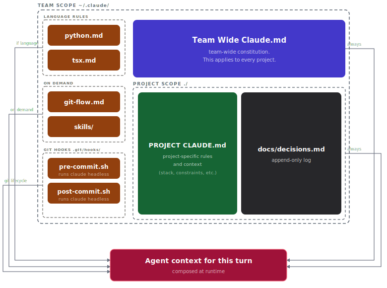

# dotclaude

My Claude Code setup. Simple. Been getting me 20-30x engineering output running with it.

## How it works

One always-on constitution at the root. Sidecars hang off it and only get pulled into context when relevant to the turn. Each turn Claude composes the constitution plus whatever sidecars apply. Context window stays lean.

## Layout

| Path | Role | When loaded |
|------|------|-------------|
| `CLAUDE.md` | Team-wide constitution | Always |
| `rules/python.md`, `rules/tsx.md` | Language sidecars | Glob match on touched files |
| `rules/branching.md` | Workflow sidecar | On demand, referenced from constitution |
| `skills/` | Skill sidecars | On demand (Claude matches request), or user-triggered with Claude surfacing them |
| `agents/`, `commands/` | Personal subagents and slash commands | Hidden for now, proprietary |
| `./CLAUDE.md` | Project constitution | Always, per project |
| `./docs/decisions.md` | Decision log | Always, per project |

Git hooks (`.git/hooks/`, installed via the `setup-git-hooks` skill) run Claude headless on the commit lifecycle.
